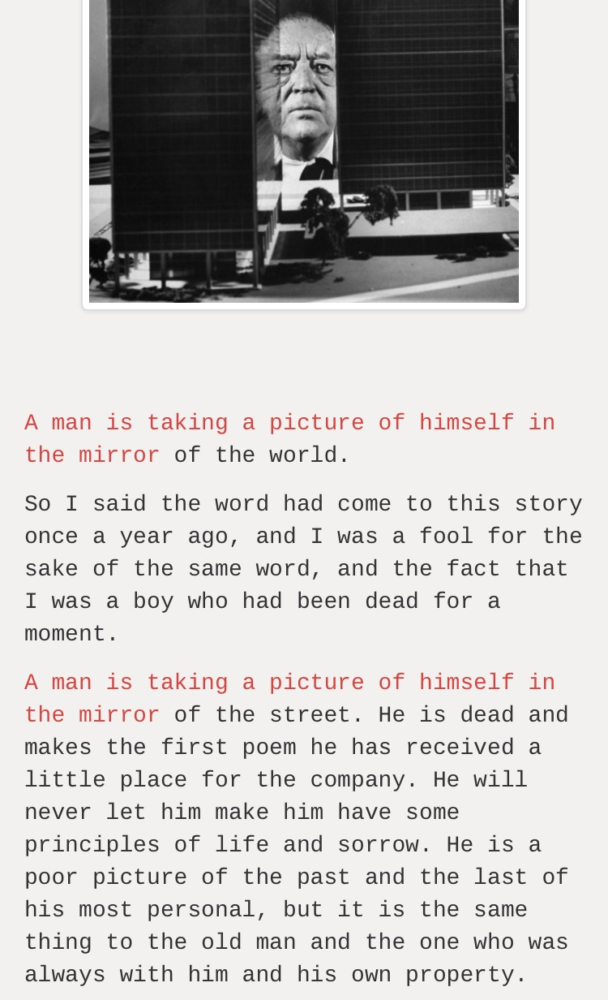

Neural Poet
===========
[![License][License Badge]][License]



> We currently run this on Python 3.5

Quickstart
==========

Clone Repository
----------------
```sh
$ git clone https://github.com/jjangsangy/neuralpoet.git
```


Create a virtualenv
-------------------
```sh
$ virtualenv -p python3 venv
```

Source Virtualenv
-----------------
```
$ source venv/bin/activate
```

Install Python Dependencies
---------------------------
```sh
$ pip install --upgrade pip setuptools wheel
$ pip install -r requirements.txt
```

Run Server
----------
```
$ python manage.py runserver
* Running on http://127.0.0.1:8080/ (Press CTRL+C to quit)
```

[License]:       https://raw.githubusercontent.com/jjangsangy/neuralpoet/master/LICENSE "License"
[License Badge]: https://img.shields.io/pypi/l/coverage.svg                             "Apache 2.0 Badge"
